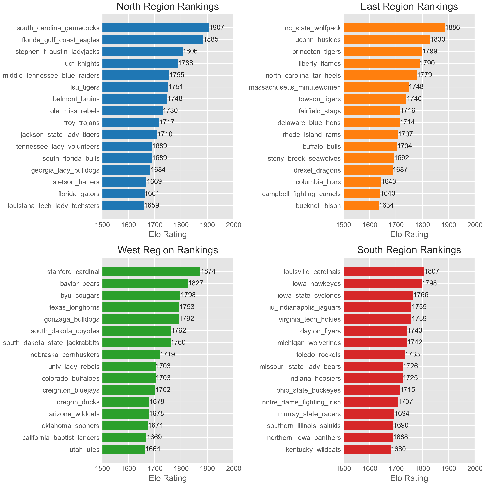
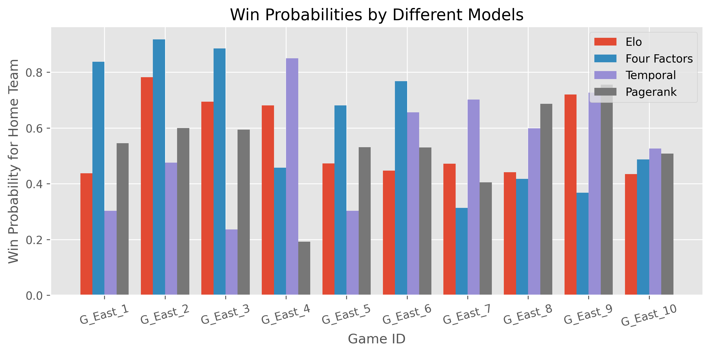
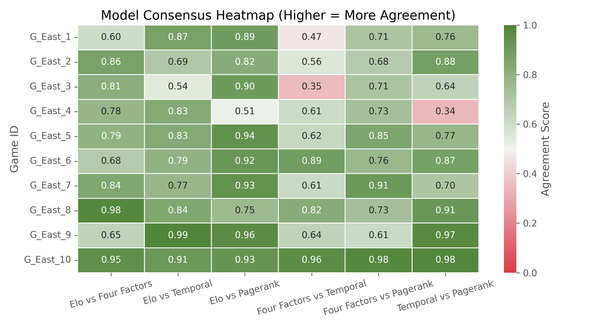

# Multi-Model Consensus: An Ensemble Approach to Basketball Predictions

[](https://www.python.org/downloads/)
[](https://opensource.org/licenses/MIT)
[](https://wsb.wharton.upenn.edu/wharton-data-competition/)

**Team Members:** Shivam Gupta, Samhitha Kovi, Ethan Baek  
**Affiliation:** Lambert High School, GA  
**Competition:** [2025 Wharton High School Data Science Competition](https://wsb.wharton.upenn.edu/wharton-data-competition/)  
**Achievement:** 🥇 **1st Place Winner** out of 490+ teams from 34 countries

## 📖 Overview

This repository contains the **winning methodology** from the 2025 Wharton High School Data Science Competition, where our team "Full Court Analysts" achieved first place among 490+ teams from 34 countries. Our ensemble approach to NCAA women's basketball prediction combines four independent models to produce robust team rankings and win probabilities.

The competition challenged teams to analyze over 5,300 NCAA Division I women's basketball games, and our methodology has been published in the Wharton Sports Analytics Journal.

### Notebooks

1. **[`1_elo_rating_system.ipynb`](1_elo_rating_system.ipynb)** - Generates primary Elo ratings and tournament predictions
2. **[`2_four_factors_analysis.ipynb`](2_four_factors_analysis.ipynb)** - Implements Four Factors ranking and validation
3. **[`3_temporal_logistic.ipynb`](3_temporal_logistic.ipynb)** - Temporal feature engineering and logistic regression
4. **[`4_pagerank_network.ipynb`](4_pagerank_network.ipynb)** - Network-based PageRank team rankings
5. **[`5_visualization_generator.ipynb`](5_visualization_generator.ipynb)** - Creates all figures and analysis plots

## 🏀 Methodology

Our ensemble approach leverages the complementary strengths of four distinct methodologies:

1. **Elo Rating System** (Primary Model) - Dynamic team strength with basketball-specific adjustments
2. **Four Factors Analysis** - Dean Oliver's fundamental basketball metrics
3. **Temporal Logistic Regression** - Captures team evolution throughout the season
4. **PageRank Network Model** - Network-based strength of schedule analysis

## 📊 Results

### Phase 1A Rankings

| Rank | North Region                  | West Region                    | South Region              |
| ---- | ----------------------------- | ------------------------------ | ------------------------- |
| 1    | South Carolina Gamecocks      | Stanford Cardinal              | Louisville Cardinals      |
| 2    | Florida Gulf Coast Eagles     | Baylor Bears                   | Iowa Hawkeyes             |
| 3    | Stephen F. Austin Ladyjacks   | BYU Cougars                    | Iowa State Cyclones       |
| 4    | UCF Knights                   | Texas Longhorns                | IU Indianapolis Jaguars   |
| 5    | Middle Tennessee Blue Raiders | Gonzaga Bulldogs               | Virginia Tech Hokies      |
| 6    | LSU Tigers                    | South Dakota Coyotes           | Dayton Flyers             |
| 7    | Belmont Bruins                | South Dakota State Jackrabbits | Michigan Wolverines       |
| 8    | Ole Miss Rebels               | Nebraska Cornhuskers           | Toledo Rockets            |
| 9    | Troy Trojans                  | UNLV Lady Rebels               | Missouri State Lady Bears |
| 10   | Jackson State Lady Tigers     | Colorado Buffaloes             | Indiana Hoosiers          |
| 11   | Tennessee Lady Volunteers     | Creighton Bluejays             | Ohio State Buckeyes       |
| 12   | South Florida Bulls           | Oregon Ducks                   | Notre Dame Fighting Irish |
| 13   | Georgia Lady Bulldogs         | Arizona Wildcats               | Murray State Racers       |
| 14   | Stetson Hatters               | Oklahoma Sooners               | Southern Illinois Salukis |
| 15   | Florida Gators                | California Baptist Lancers     | Northern Iowa Panthers    |
| 16   | Louisiana Tech Lady Techsters | Utah Utes                      | Kentucky Wildcats         |

### Phase 1B Tournament Predictions

| Game      | Home Team           | Away Team      | Win Probability |
| --------- | ------------------- | -------------- | --------------- |
| G_East_1  | Rhode Island        | North Carolina | 43.8%           |
| G_East_2  | NC State            | Rhode Island   | 78.2%           |
| G_East_3  | NC State            | North Carolina | 69.5%           |
| G_East_4  | Liberty             | Bucknell       | 68.1%           |
| G_East_5  | Drexel              | Delaware       | 47.3%           |
| G_East_6  | Massachusetts       | Princeton      | 44.7%           |
| G_East_7  | Buffalo             | Stony Brook    | 47.2%           |
| G_East_8  | Fairfield           | Towson         | 44.1%           |
| G_East_9  | UConn               | Campbell       | 72.0%           |
| G_East_10 | American University | Columbia       | 43.5%           |

### Visualizations

  
_Figure 1: Elo Ratings for Top 16 Teams in Regions_

  
_Figure 2: Predicted Win Probabilities for East Region Matchups_

  
_Figure 3: Cross-model consensus analysis for East region predictions_

## 🏆 Competition

This methodology was developed for the [2025 Wharton High School Data Science Competition](https://wsb.wharton.upenn.edu/wharton-data-competition/), which challenged 490+ teams from 34 countries to predict NCAA women's basketball tournament outcomes. The competition emphasized not just predictive accuracy, but also methodological rigor, clear communication, and basketball domain knowledge.

**Competition Judges:**

- Adi Wyner (Faculty Co-Director, Wharton Sports Analytics and Business Initiative)
- Sam Garofalo (Basketball Data Science Lead, NBA and WNBA)
- Neil Paine (Independent Journalist and Sports Data Analyst)
- Liana Valentino (Lead Data Scientist, Nike)
- Dean Oliver (Senior Stats Analyst, ESPN)

## 📝 Citation & Usage

This work must be cited when used:

```
@article{gupta2025multimodel,
  title={Multi-Model Consensus: an Ensemble Approach to Basketball Predictions},
  author={Gupta, Shivam},
  journal={Wharton Sports Analytics Journal},
  year={2025},
  note={1st Place Winner, 2025 Wharton High School Data Science Competition},
  url={https://github.com/shivamCode0/whsdsc-2025}
}
```

## 📧 Contact

- **Shivam Gupta** - shivam [at] shivam.pro
- **Project Link**: https://github.com/shivamCode0/whsdsc-2025
- **Competition**: https://wsb.wharton.upenn.edu/wharton-data-competition/
